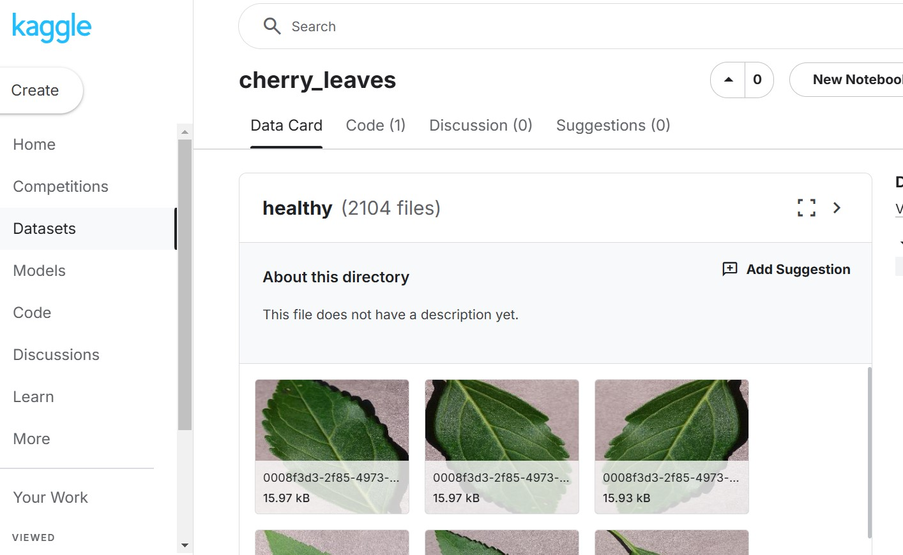

# Mildew Detection in Cherry Leaves

The goal of this project is to visually differentiate between healthy cherry leaves and those affected by powdery mildew.

This app is designed based on a supervised, single-label, binary classification ML model. Binary classifier is used to predict the outcome.

Live Link: https://mildew-detector-in-trees-984795549977.herokuapp.com/

## Table of Contents
1. [Dataset Content](#dataset-content)
2. [Crisp-DM](#crisp-dm)
3. [Business Requirements](#business-requirements)
4. [Hypothesis and Validation](#hypothesis-and-how-to-validate)
5. [The rationale to map the business requirements](#the-rationale-to-map-the-business-requirements)
6. [ML Business Case](#ml-business-case)
7. [Dashboard Design](#dashboard-design)
8. [Deployment](#deployment)
9. [Technologies and Languages Used](#technologies-and-languages-used)
10. [Main Data Analysis and Machine Learning Libraries](#main-data-analysis-and-machine-learning-libraries)
11. [Credits](#credits)
12. [Acknowledgements](#acknowledgements)

## Dataset Content

- The dataset used for this project is supplied by Code Institute and sourced from [Kaggle](https://www.kaggle.com/codeinstitute/cherry-leaves).

- The dataset contains more than 4000 images of healthy or diseased cherry leaves taken from Farmy & Foods crop fields. Diseased cherry leaves contain powdery mildew, a fungal disease that affects a wide range of plants. This is a serious concern for the company since it can compromise their product quality. 

- The dataset is available at this link: https://www.kaggle.com/datasets/codeinstitute/cherry-leaves

## Crisp-DM 

### Definition and Usage

CRISP-DM (Cross-Industry Standard Process for Data Mining) is a well-established methodology for data mining and analytics projects. It provides a structured framework, typically broken down into these key stages:

- Business Understanding: Define the business problem, objectives, and goals.
- Data Understanding: Collect and explore the data, ensuring its quality and relevance.
- Data Preparation: Clean, transform, and engineer the data to make it ready for analysis.
- Modeling: Choose and develop the appropriate predictive models.
- Evaluation: Assess the model's performance and its alignment with business objectives.
- Deployment: Deploy the model into production for real-world use.
- Monitoring: Continuously monitor and maintain the model’s performance over time.

- This process helps organizations systematically approach data mining and analytics to achieve successful outcomes.

## Business Requirements

The cherry plantation crop from Farmy & Foods is facing a challenge where their cherry plantations have been presenting powdery mildew. Currently, the process is manual verification if a given cherry tree contains powdery mildew.The company has thousands of cherry trees located on multiple farms across the country. As a result, this manual process is not scalable due to the time spent in the manual process inspection.

1. The client is interested in conducting a study to visually differentiate a healthy cherry leaf from one with powdery mildew.
2. The client is interested in predicting if a cherry leaf is healthy or contains powdery mildew.
3. The client is interested in having the option to download a prediction report for the examined leaves.
4. It was agreed with the client to attain an accuracy rate of 97%.

## Hypothesis and how to validate?

**Hypothesis**: A machine learning model can effectively classify cherry leaves as healthy or affected by powdery mildew using image-based features.

**Validation**: This hypothesis will be tested through a systematic workflow involving data preparation, model training, and evaluation. The dataset will include images of healthy cherry leaves and those affected by powdery mildew.

The distinction between healthy and diseased leaves is based on observable differences in their appearance. These differences will be analyzed using methods such as average image studies and image montages to highlight visual contrasts between the two categories.

The model's ability to differentiate between contaminated and healthy leaves will be evaluated using a test dataset with a classification accuracy of 97%.

**Hypothesis**:A user-friendly dashboard can be developed to provide instant cherry leaf health assessments based on uploaded images.

**Validation**:To fulfill this hypothesis, we will design and develop a user-friendly web dashboard. During validation, we will conduct usability testing with potential end-users to ensure the dashboard's intuitiveness and effectiveness.It will demonstrate its capability to deliver quick and accurate cherry leaf health assessments.

## The rationale to map the business requirements

### Business Requirement 1: Data Visualisation
- Display the mean and standard deviation images for mildew-infected and uninfected cherry leaves.
- Display the difference between average mildew-infected and uninfected leaves.
- Display an image montage for either mildew-infected or uninfected leaves.
### Business Requirement 2: Classification and Prediction
- Build an ML model and use it to perform predictions based on whether leaves are infected or not, with an accuracy rating of at least 97%.

## ML Business Case

1. Business Objective
    - Objective: By using an ML model we will solve the problem of differentiating between healthy and powdery mildew cherry leaves saving Farmy & Foods many hours of labour used for the current manual process.
    - Business impact: To improve Farmy & Foods crop current health monitoring process, leading to reduced crop losses and maintaining the highest customer satisfaction.
2. Business Problem
    - Description & Challenges: Farmy & Foods is currently spending many hours of manual inspection is time-consuming and prone to errors when trying to identify cherry leaves affected with powdery mildew, leading to ineffective treatments and crop losses.
    - Goals: To make use of an ML model to automatically and accurately identify cherry leaves affected with powdery mildew with at least 97% accuracy.
3. Proposed Solution
    - ML Approach: A Convolutional Neural Network (CNN) model will be developed to classify between healthy and affected with powdery mildew leaf images.
    - Data Requirements: An image data set consisting of images of both healthy and affected with powdery mildew leaves.
4. Business Value
    - By using this model, we expect to quickly and accurately detect affected crops, allowing for early treatments, healthier plants and satisfied customers. Success will be measured by the model's accuracy and how well it works in detecting affected leaves. The benefits will include fewer crop losses and better quality harvests.
5. Risk Mitigation
    - Data Quality: Use strong methods to collect and prepare image data, including adding variety and checking quality, to ensure the dataset is diverse and of high-quality.
    - Model Performance: The model might not reach the required accuracy, so it will be refined by using cross-validation and repeated testing.
    - User: Users might resist the new system. To help, the dashboard withh be user-friendly and simple to use and understand, detailed guides, support, and explanations are available.
    - Data privacy: NDAs and ethical guidelines will be followed to keep cherry leaf images and related data confidential and secure.
6. Implementation Plan
    - Data collection & processing 
    - Model development & training 
    - Model evaluation, testing, optimization and deployment

[Top ⇧](#table-of-contents)

## Dashboard Design

### Page 1 - Project Summary

Page includes some general background on the project, the client, and the reason for the project's inception. 
- The business requirements of the project are stated, as well as details of the dataset.
- The project hypothesis is outlined, linking the business needs with the requirements of the project
- The conclusions of the project are stated, with success measured against the desired business outcomes.

### Page 2 - Leaves Visualiser

This page displays the image plots generated from the DataVisualisation notebook, which answer business requirement 1. Shown are:
- Images displaying the mean and variance for healthy leaves(set 0), and unhealthy leaves(set 1)
- An image showing the visual difference between an average healthy and unhealthy leaf
- An image montage creator, with the option to generate an image montage of either healthy or unhealthy leaves from the dataset

### Page 3 - Mildew Detection

The mildew detection page fulfils business requirement 2, providing the ability for a user to upload images for predicting if mildew is present
- Includes link to dataset for prediction use
- Image upload widget, with the ability to upload multiple image files. These are then standardised and fed into the ML model.
- The images are displayed, with their infection status prediction and probability
- A button allows the user to download a report with prediction details of the images they have uploaded 

### Page 4 - Project Hypothesis

This page includes the hypothesis of the ML
- Includes main Hypothesis and validation according to the business requirement.

### Page 4 - ML Performance

This page summarises the performance metrics of the machine learning model used in the project. Show are:
- A bar graph summarising the data split between the different sets, per label
- Line graphs displaying the accuracy and loss trends for the model
- A summary of the generalised performance of the model on the test dataset
- Summary of the confusion matrix
- Summary of the classification report
- A generalised test set

[Top ⇧](#table-of-contents)

## Technologies and Languages Used

- [Git & GitHub](https://github.com/)
    - Version control and storage code
- [GitPod](https://www.gitpod.io/) 
    - Used as the development environment
- [Heroku](https://www.heroku.com/) 
    - Used to deploy the site (Cloud based)
- [Am I Responsive](https://ui.dev/amiresponsive) 
    - Used to for the image across devices in the README.md
- [Chat GPT](https://chatgpt.com/) 
    - Used to better word some of my descriptions and general assistance & guidance.

### Languages
- Python

# Data Analysis and Machine Learning Libraries

Following are the list of libraries used in the project

1.**Numpy**: It is an open-source, python library used for working with arrays. NumPy offers comprehensive mathematical functions, random number generators, linear algebra routines.

2.**Pandas**: It is an open-source, python package used for working with data sets. It has functions for analyzing, cleaning, exploring, and manipulating data.

3.**Matplotlib**: It is a cross-platform, data visualization and graphical plotting library for python.

4.**Seaborn**: It is Python data visualization library based on Matplotlib. It will be used to visualize random distributions.

5.**Plotly**: It is an interactive, open-soource, and browser-based gra6. Tensorflow: It is an open-sourec machine learning platform focused on deep neural networks.phing library. Used to create visualisations within Jupyter notebooks to present the data.

6.**Tensorflow**: It is an open-source machine learning platform focused on deep neural networks.

7.**Shutil**: Used form file copying and removal.

8.**Streamlit**: It is used to create web apps for data science and machine learning.

9.**Joblib**: It is a set of tools to provide lightweighting pipelining in Python.

10.**PIL**: Python Imaging Library is a free and open-source additional library for the Python programming language that adds support for opening, manipulating, and saving many different image file formats.

## Fixed Bugs

- Initially when I creates an app on Heroku, the stack by default does not support the Python version that I was using, so I had to change the stack of my project from 22 to 20.

- The slug size was also too large. So I added the extra large files in .slugignore file.

- The Image montage wasn't working cause the list was in the .gitignore .I just had to remove validation dataset.

- The data was running the whole Epoch so had to fix the earlystopp with patience 3 instead 4 and added a mode to max.It fixed that it stops early. 

## Unfixed Bugs

- No unfixed bugs were detected 

[Top ⇧](#table-of-contents) 

## Deployment

### Cloning the [GitHub](https://github.com/) repository

Cloning a repository will download a full copy of the data to your computer. This is useful when larger commits need to be pushed, adding or removing files and fixing merge conflicts.

1. Login to GitHub
2. Click the repository you wish to clone (Top left corner)
3. Click 'Code' which is shown above the list of files in the repository
4. Click the 'Local' tab, copy the HTTPS URL
5. Open Gitpod Workspaces, click 'New Workspace'
6. Paste the copied URL into the space given under 'Repository URL'
7. Click 'Continue' and the local clone will be created.

### Forking the [GitHub](https://github.com/) repository

Forking a GitHub repository will allow you to make a copy of the repository, changes can then be made that will not affect the original repository. This is useful for proposed changes, ideas, fixes to an original repository.

1. Login to GitHub
2. Click the repository you wish to fork (Top left corner)
3. Click the 'Fork' drop-down in the top right-hand corner
4. Then click 'Create a new fork' you will now have a copy to work on.

### Heroku

- The App live link is: 

- The project was deployed to Heroku using the following steps.
1. Login to Heroku
2. On the Heroku dashboard click on 'New'
3. Select 'Create New App'
4. Add an app name and select your region
5. Click 'Create App'
6. At the top of the page again, click 'Deploy'
7. Click on 'Github' as your deployment method
8. Search the relevant repo and link these
9. Once linked, select 'Automatic deploys from' or 'Manual Deploy'
10. The deployment process should happen smoothly if all deployment files are fully functional. Click the button 'Open App' on the top of the page to access your App.
11. If the slug size is too large, then add large files not required for the app to the .slugignore file.

## Credits

- Code Institute - Walkthrough Project Malaria Detector for steps, guidance and following along to get this far in my project 5.

- [ssrelakshmi88/mildew-detection](https://github.com/ssreelakshmi88/mildew-detection-cherry-leaves_milestonePP5) in Cherry Leaves Detector: Readme guidance

- [Flaticon](https://www.flaticon.com/free-icons/cherry)
- For the cute cherry icon for my tab.

## Acknowledgements

My mentor **Precious Ijege** for support and guidance.

For getting the web app up and running-Streamlit documentation: 

Project was also inspired by Code Institute Walkthrough project 

[Top ⇧](#table-of-contents)